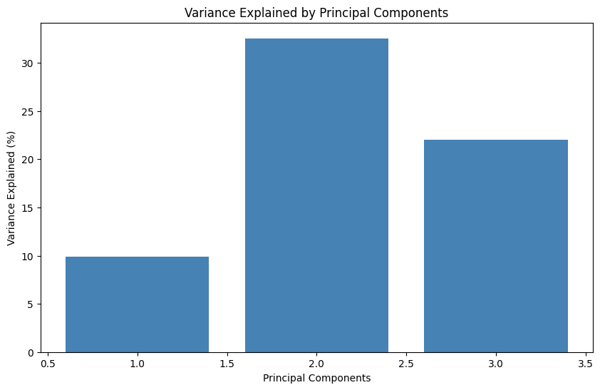
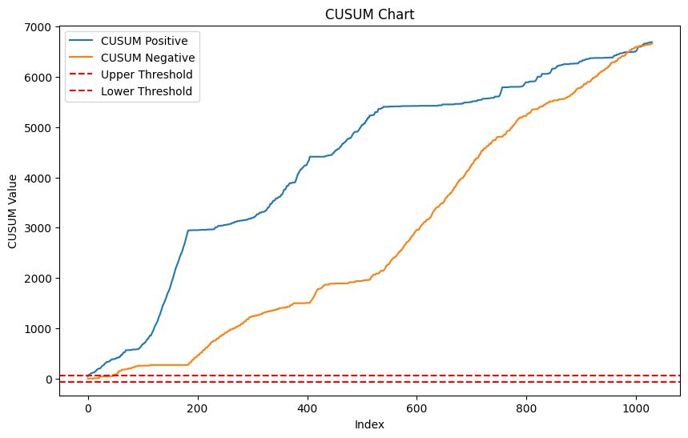
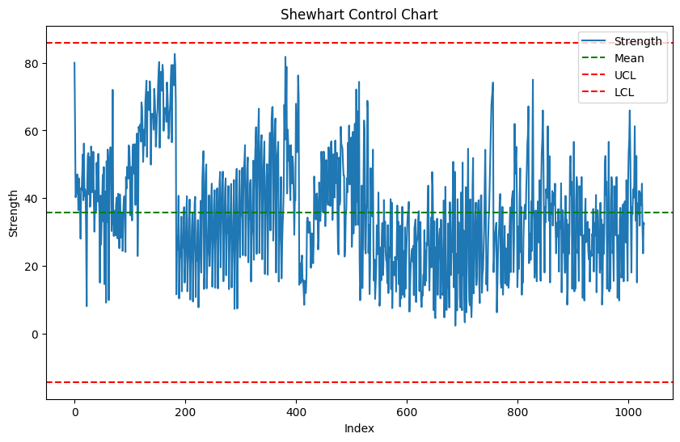
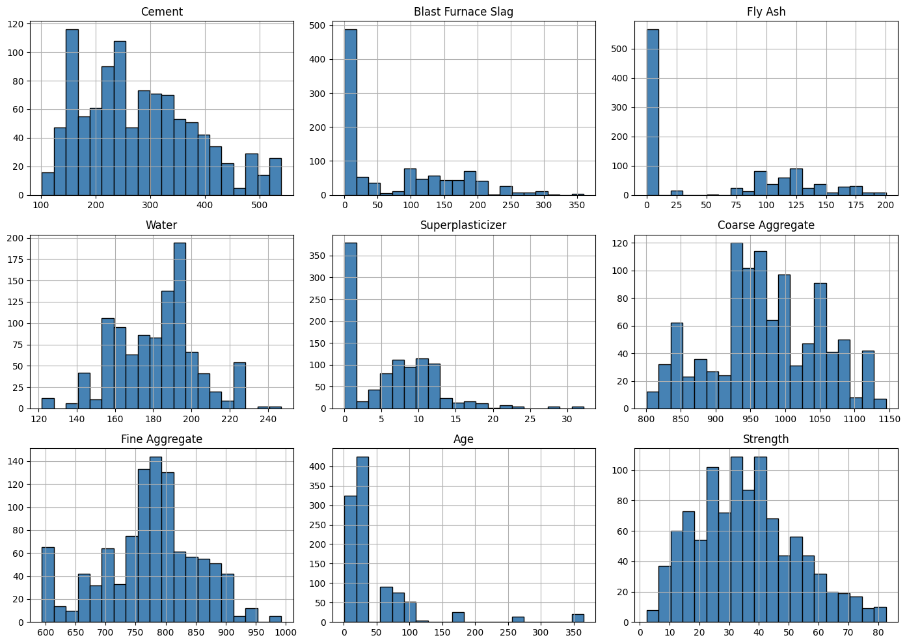

# Concrete Strength Monitoring Using Machine Learning and Statistical Control Charts

## Overview
This project was part of the Advanced Linear Algebra course where we had to set up statistical control charts to monitor processes. It was taught by Dr. Babar Zaman, and this project represents my take on it.


---

## Features

1. **Multivariate Control Chart Analysis** - Monitors process stability using multivariate methods.  
2. **Scatter Plot Analysis** - Visualizes relationships between variables.  
3. **Feature Importance (Random Forest)** - Identifies important features in datasets using Random Forest models.  
4. **PCA (Principal Component Analysis)** - Reduces dimensionality while retaining essential information.  
5. **Cumulative Sum (CUSUM)** - Tracks process shifts over time.  
6. **Shewhart Control Charts** - Evaluates process variations against control limits.  
7. **Ingredients vs. Strength** - Analyzes the relationship between ingredients and strength.  
8. **Confusion Matrix** - Evaluates classification model performance.  
9. **Distribution Analysis** - Studies data distribution patterns.  
10. **Concrete Data Analysis** - Evaluates data related to concrete strength and properties.

---

## Dataset

The dataset used in this project is sourced from Kaggle (https://www.kaggle.com/datasets/zain280/concrete-data/data) and includes 1030 records with 8 distinct features:
- **Cement**
- **Blast Furnace Slag**
- **Fly Ash**
- **Water**
- **Superplasticizer**
- **Coarse Aggregate**
- **Fine Aggregate**
- **Age**

The target variable is **Strength**, representing the concrete’s compressive strength in megapascals (MPa).

---

## Methodologies

### Statistical Process Control
- **Shewhart Control Charts**: Monitor consistency and detect anomalies.
- **CUSUM Control Charts**: Identify gradual drifts in mean values.

### Dimensionality Reduction
- **Principal Component Analysis (PCA)**: Reduces dimensional complexity while retaining 95.19% of variance, highlighting key trends.

### Machine Learning
- **Random Forest Models**: Predict strength and rank feature importance, identifying Cement and Age as dominant predictors.

---

## Application
This project uses **Streamlit** to create an interactive dashboard for visualizing results and uploading datasets. The following visualizations are supported:

1. Scatter Plot
2. Feature Importance - Random Forest
3. PCA
4. CUSUM
5. Shewhart Charts
6. Ingredients vs. Strength
7. Confusion Matrix
8. Distribution Analysis

---

## Visuals
### Grid View of Visualizations
| Scatter Plot Analysis                               | Feature Importance - Random Forest                     |
|----------------------------------------------------|--------------------------------------------------------|
|         |  |

| PCA - Principal Component Analysis                 | CUSUM Control Chart                                   |
|----------------------------------------------------|--------------------------------------------------------|
|                             |                           |

| Shewhart Control Chart                              | Ingredients vs. Strength                               |
|----------------------------------------------------|--------------------------------------------------------|
|                   |  |

| Confusion Matrix                                   | Distribution Analysis                                  |
|----------------------------------------------------|--------------------------------------------------------|
| |     |

---

## Setup Instructions

1. Clone this repository:
```
git clone git@github.com:0xnomy/statistical-control-charts.git
```

2. Install dependencies:
```
pip install -r requirements.txt
```

3. Run the application:
```
open multivariate-control-chart-analysis.ipynb
streamlit run app.py
```

---

## Technologies Used
- **Python**
- **Streamlit**
- **Scikit-learn**
- **Matplotlib**
- **Pandas**
- **NumPy**

---

## Results and Findings
- Cement and Age were identified as the most influential features.
- PCA captured 95.19% variance, simplifying analysis.
- Random Forest achieved 88% prediction accuracy.
- Control charts effectively detected anomalies and process deviations.

---

## References
- Montgomery, D. C. (2020). Introduction to Statistical Quality Control.
- Zaman, B., Riaz, M., Abbas, N., & Does, R. J. M. M. (2015). Mixed cumulative sum–exponentially weighted moving average control charts: An efficient way of monitoring process location. Quality and Reliability Engineering International, 31(8), 1407–1421
- Hastie, T., Tibshirani, R., & Friedman, J. (2009). The Elements of Statistical Learning.
